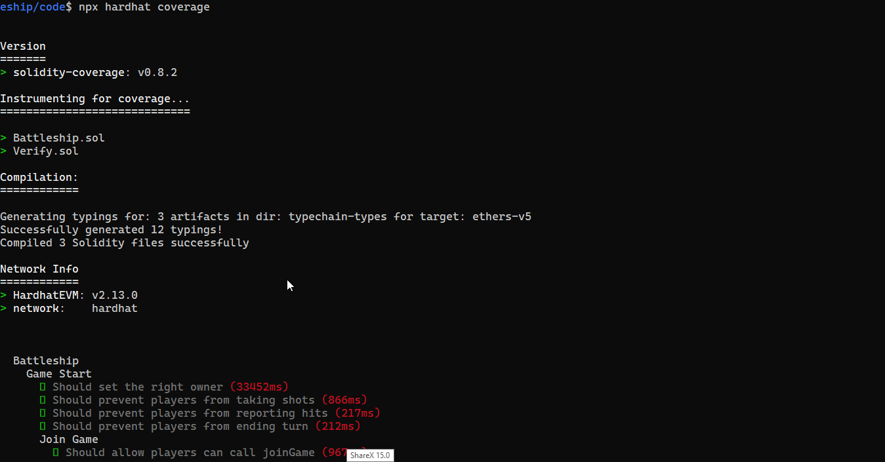
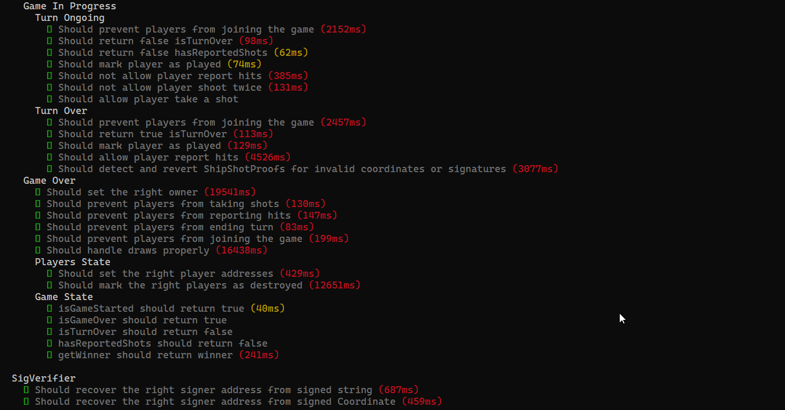
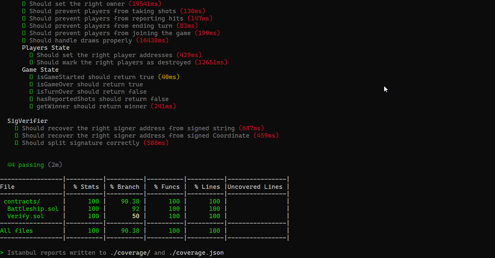
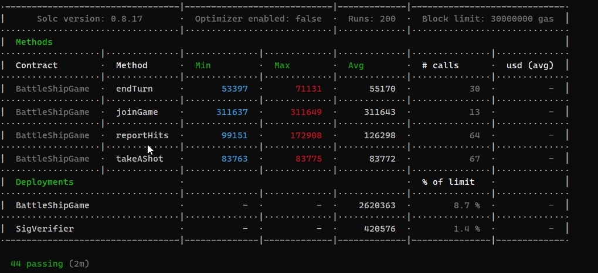

# A Game of Battleship on a Public Blockchain (Ethereum)

## What is Battleship

Battleship, a guessing game played between players on separate grids representing their fleets of ships. Each player has their own grid and they place their ships on the grid in secret. The objective of the game is to sink the opponent's fleet of ships by correctly guessing the locations of their ships on the grid.

Players take turns calling out coordinates - any `(x,y)`, on the opponent's grid, in an attempt to find the location of the opponent's ships. If a player guesses a coordinate where a ship is located, the opponent must respond with "hit". If a player guesses a coordinate where there is no ship, the opponent must respond with "miss". The player who sinks all of their opponent's ships first wins the game.

## What we'll be doing?

In this tutorial, we'll be building our very own game of Battleship on Ethereum. There is a slight hitch however. Battleship is a [game of incomplete information](http://gametheory101.com/courses/game-theory-101/introduction-to-incomplete-information/), and that doesn't sit nicely with the public, permission-less nature of Ethereum (and other public blockchains like Polygon). While we can declare state variables as private, [anyone could still access their values](https://ethereum.stackexchange.com/questions/44893/how-do-i-see-the-value-of-a-string-stored-in-a-private-variable). How do we store private data on a public blockchain? It's a catch-22, or is it?

## Our Approach

There are multiple approaches to privacy on the blockchain thus far. One particularly promising one has been [ZKPs](https://medium.com/@ashwin.yar/zkps-the-ultimate-shield-for-your-privacy-in-web3-a-beginners-introduction-to-the-future-of-e60918da01b4) (zkSNARKs, zkSTARKs etc.). However in this tutorial, we'll be going lightweight.

We need to a create a unique identifier for each players ship's coordinate that would be impossible to guess/reverse by anybody else, but which can be verified in the future, to reveal the initial data (ship's coordinate). We need a [one-way function]()! Public-private signatures are a perfect match for this use case.

Public-private signatures, are also known as digital or cryptographic signatures. It is the same technology behind authorizing transactions on the blockchain. We sign an arbitary byte of data (a ship coordinate in this case) with our private key, and this generates a signature. We can then retrieve the corresponding public key/address of a signature and confirm if it matches the expected value.Signing a message with a private key is deterministic, meaning signing the same data with the same private key will always produce the same signature.

Here's a brief overview of how it all fits together:
- _Player1_ signs their ship coordinates and we store those signatures in our smart contract.
- _Player2_ declares which coordinates they've shot at.
- _Player1_ signs all the "shot" coordinates, and we check if such a signature exists in our smart contract. No? That was a miss. Yes? A ship has been hit!

Couple of things to consider:

- **Could _Player1_ sign the wrong coordinates and provide us inaccurate data?** Possibly, that's why we verify the signature in our smart contract to make sure they signed the right data.
- **Since we treat all shots as the same regardless of who shot it, could _Player1_ sink his/her own ships?** In this implementation, yes. We could make it otherwise, but I think a bomb is a bomb, regardless of where it blows. You decide if that's a bug or feature.

## Diving In

This is the source code of a smart contract in the Solidity programming language for our battleship game. For now I restricted it to a two-players player game, but with a little bit of work, it could support much more. Each players gets 10 coordinates (blocks) to form their ships.

I think it would be best to envision the game as multiple states:

### State 1 - Game Start

- The smart contract gets deployed with a whitelist of player addresses allowed to play in that game. It makes it easier to track when all players have joined and the game has started.
- Players pick their ships coordinates, sign them, and send the signatures to the smart contract. Once they have done that, they have joined the game.
- When all players have joined the game, we're off to the races. Players can not change their signatures (ship positions), nor can they take shots at this stage.

### State 2 - Game In Progress - Turn In Progress

- Turn 1, or Turn 10, it doesn't matter much. Each player can pick a single coordinate where he'd be shooting at. We store this coordinate in our smart contract.
- We make sure everyone has taken a shot before marking the turn as over.

### State 3 - Game In Progress - Turn Over

- Players retrieve all shots for that turn, sign them, and submit the signatures back to the smart contract.
- For each of the signatures, we verify the player signed the right data. If the signature exists in our "list" of known ships, it's a hit!

### State 4 - Game Over

- For a player to win, every other player must have lost all their ships. It's a draw when nobody has any ships left.

Time to get into the code. If you'd like to follow along:

Clone the repository

> Heads up! It's a TypeScript project, but if you're not familiar with TypeScript, basic JavaScript understanding should be more than enough to follow along.

<br>

```bash
git clone https://github.com/chainstacklabs/developer-hub-content
```

and install [Hardhat](https://hardhat.org/tutorial/creating-a-new-hardhat-project)

```
npm install --save-dev hardhat
```

## Verifying Digital Signatures

Since all signatures created on Ethreum make use of the ECDSA curve, there have been suggestions to have a [native compiled function for verifying signatures](https://eips.ethereum.org/EIPS/eip-665). However, that's not yet available, and we have to roll our own solution.

We need a smart contract to derive the corresponding address of the public key used to create the digital signature. We'll be using the SigVerifier contract from the official Solidity documentation with some modifications.


```js
// SPDX-License-Identifier: GPL-3.0-or-later
pragma solidity ^0.8.0;

contract SigVerifier {
    function RecoverSigner(
        bytes32 _hashedMessage,
        uint8 _v,
        bytes32 _r,
        bytes32 _s
    ) public pure returns (address) {
        bytes memory prefix = "\x19Ethereum Signed Message:\n32";
        bytes32 prefixedHashMessage = keccak256(
            abi.encodePacked(prefix, _hashedMessage)
        );
        address signer = ecrecover(prefixedHashMessage, _v, _r, _s);
        return signer;
    }

    function SplitSignature(
        bytes memory sig
    ) public pure returns (uint8 v, bytes32 r, bytes32 s) {
        require(sig.length == 65, "Invalid Signature");

        assembly {
            // first 32 bytes, after the length prefix.
            r := mload(add(sig, 32))
            // second 32 bytes.
            s := mload(add(sig, 64))
            // final byte (first byte of the next 32 bytes).
            v := byte(0, mload(add(sig, 96)))
        }

        return (v, r, s);
    }
}

```
Digital signatures in Ethereum are based on the ECDSA curve. Each signature contains three parameters, `r`, `s`, and `v`. We can derive these parameters from a signature by splitting it into the requisite number of bytes.
Retrieving the public address from these parameters is as simple as invoking Solidity's `ecrecover` function.
This is a relatively costly process and consumes quite a bit of gas compared to normal transactions. To optimize the gas cost, we made use of assembly in our smart contract to split the signature. 
We could also have split the signature offchain with JavaScript or another programming language.


## The Smart Contract

```js
// SPDX-License-Identifier: GPL-3.0-or-later
pragma solidity ^0.8.10;

import "contracts/Verify.sol";

contract BattleShipGame is SigVerifier {
    // Admin
    address payable public owner;

    // Max Number of players participating in the game
    uint public constant NO_PLAYERS = 2;

    // Number of ship pieces a player can have, to build their ships
    uint public constant NO_SHIP_PIECES = 10;

    // All the players participating in the game
    mapping(address => bool) public players;
    address[] public playersAddress; // We use an array because it's easier to iterate than a mapping

    // Player ships
    mapping(address => mapping(bytes => bool)) ships;

    // Player ships that have been destroyed
    mapping(address => Coordinate[]) destroyedShips;

    // Players who have lost all their ships
    mapping(address => bool) public destroyedPlayers;
    uint public numberOfDestroyedPlayers;

    mapping(address => Coordinate) public playerShots;
    mapping(address => bool) public playerHasPlayed;
    mapping(address => bool) public playerHasPlacedShips;
    mapping(address => bool) public playerHasReportedHits;

    bool public isGameOver;

    struct Coordinate {
        uint8 x;
        uint8 y;
    }

    struct ShipShotProof {
        bytes signature;
        // The address of the player that shot
        // at this coordinate
        address shotBy;
    }

    event ShotReport(
        Coordinate coord,
        address target,
        address shotBy,
        bool isHit
    );

    event PlayerJoinedGame(address player, uint playerIndex);

    // Emitted when a player loses all his ships
    event PlayerLost(address player);

    constructor(address[] memory _playersAddress) payable {
        require(
            _playersAddress.length == NO_PLAYERS,
            "_playersAddress does not match the number of expected players"
        );
        for (uint i = 0; i < _playersAddress.length; i++) {
            address playerAddress = _playersAddress[i];
            players[playerAddress] = true;
            playersAddress.push(playerAddress);
            emit PlayerJoinedGame(playerAddress, i);
        }
        owner = payable(msg.sender);
    }

    function joinGame(bytes[] memory _playerShips) public {
        require(!isGameOver, "Game is over");
        require(players[msg.sender], "Address is not a part of this game");
        require(
            _playerShips.length == NO_SHIP_PIECES,
            "Number of ship pieces does not match the expected value"
        );
        require(
            !playerHasPlacedShips[msg.sender],
            "Player has already placed ships"
        );

        for (uint i = 0; i < _playerShips.length; i++) {
            bytes memory shipHash = _playerShips[i];
            require(
                !ships[msg.sender][shipHash],
                "User has already placed a ship on this tile."
            );
            ships[msg.sender][shipHash] = true;
        }
        playerHasPlacedShips[msg.sender] = true;
    }

    function takeAShot(Coordinate memory _coord) public {
        require(isGameStarted(), "Game hasn't started");
        require(!isGameOver, "Game is over");
        require(players[msg.sender], "msg.sender is not a player in this game");
        require(
            !playerHasPlayed[msg.sender],
            "Player has made a move for this turn"
        );

        playerShots[msg.sender] = _coord;
        playerHasPlayed[msg.sender] = true;
    }

    function reportHits(ShipShotProof[] memory _shotSignatures) public {
        require(isGameStarted(), "Game hasn't started");
        require(!isGameOver, "Game is over");
        require(isTurnOver(), "All players have not played for this turn.");
        require(
            _shotSignatures.length <= NO_PLAYERS,
            "No way you can validate more shots than there are players!"
        );

        for (uint i = 0; i < _shotSignatures.length; i++) {
            ShipShotProof memory shotProof = _shotSignatures[i];
            (bool _isHit, Coordinate memory coord) = isHit(shotProof);
            if (_isHit) {
                destroyPlayerShip(msg.sender, coord);
            }
            emit ShotReport({
                coord: coord,
                target: msg.sender,
                shotBy: shotProof.shotBy,
                isHit: _isHit
            });
        }
        playerHasReportedHits[msg.sender] = true;
    }

    function isHit(
        ShipShotProof memory _hitProof
    ) internal view returns (bool, Coordinate memory) {
        Coordinate memory _playerShot = playerShots[_hitProof.shotBy];
        bytes32 _calculatedHash = keccak256(
            abi.encodePacked(_playerShot.x, _playerShot.y)
        );

        (uint8 v, bytes32 r, bytes32 s) = SplitSignature(_hitProof.signature);
        address signer = RecoverSigner(_calculatedHash, v, r, s);
        require(
            signer == msg.sender,
            "msg.sender and derived message signer do not match"
        );

        // A ship piece at this coordinate exists
        return (ships[msg.sender][_hitProof.signature] == true, _playerShot);
    }

    //
    function destroyPlayerShip(
        address _player,
        Coordinate memory _coord
    ) internal {
        destroyedShips[_player].push(_coord);

        // All of a player's ships have been destroyed
        if (destroyedShips[_player].length == NO_SHIP_PIECES) {
            destroyedPlayers[_player] = true;
            numberOfDestroyedPlayers++;
            emit PlayerLost(_player);
        }
    }

    // Check if all players have played for this turn
    function isTurnOver() public view returns (bool) {
        for (uint i = 0; i < playersAddress.length; i++) {
            address _playerAddress = playersAddress[i];
            if (!playerHasPlayed[_playerAddress]) {
                return false;
            }
        }
        return true;
    }

    function hasReportedShots() public view returns (bool) {
        for (uint i = 0; i < playersAddress.length; i++) {
            address _playerAddress = playersAddress[i];
            if (!playerHasReportedHits[_playerAddress]) {
                return false;
            }
        }
        return true;
    }

    // End the current turn and reset all variables
    function endTurn() public returns (bool) {
        require(
            isTurnOver(),
            "The turn is not yet over, some players are yet to shoot"
        );
        require(hasReportedShots(), "Some players are yet to report hits");

        // Do we have a winner?
        // Only one player is left standing
        // It's also possible that everybody destroyed everybody. (Edge case)
        if (numberOfDestroyedPlayers >= (NO_PLAYERS - 1)) {
            isGameOver = true;
        }

        for (uint i = 0; i < playersAddress.length; i++) {
            address _playerAddress = playersAddress[i];
            playerHasPlayed[_playerAddress] = false;
            playerHasReportedHits[_playerAddress] = false;
            playerShots[_playerAddress] = Coordinate({x: 0, y: 0});
        }
        return true;
    }

    function isGameStarted() public view returns (bool) {
        for (uint i = 0; i < playersAddress.length; i++) {
            address _playerAddress = playersAddress[i];
            if (!playerHasPlacedShips[_playerAddress]) {
                return false;
            }
        }
        return true;
    }

    function getWinner() public view returns (address winner) {
        require(isGameOver, "The game isn't over yet");
        for (uint i = 0; i < playersAddress.length; i++) {
            address _playerAddress = playersAddress[i];
            if (!destroyedPlayers[_playerAddress]) {
                return _playerAddress;
            }
        }
        // No winner
        return address(0);
    }
}


```

Here is a summary of what the code does:

- The game has a fixed number of players (two), each of whom can place 10 ship pieces on any coordinate.
- Players take turns shooting at their opponent's grid by specifying the coordinates of a square. If a ship piece is on that square, it is destroyed.
- If a player loses all of their ships, the game is over and the other player wins.
- The contract uses the `SigVerifier` contract from the `Verify.sol` file, which provides functions for verifying digital signatures.
- The contract emits events whenever a player takes a shot or loses all of their ships.

The contract has several mappings to keep track of the state of the game.

> If you're not familiar EVM programming, mappings might seem an odd choice to represent our data model. However, to keep gas costs down and optimize UX, we want to avoid looping through and modifying large arrays in our smart contract.

Here are some of the key ones:

- `players`: a mapping of addresses to booleans indicating whether each address is a player in the game.
- `ships`: a mapping of each player's address to a mapping of ship hashes to booleans. The `ships` mapping keeps track of which ship pieces each player has placed on the grid.
- `destroyedShips`: a mapping of each player's address to an array of `Coordinate` structs. The `destroyedShips` mapping keeps track of which of a player's ships have been destroyed.
- `playerShots`: a mapping of each player's address to a `Coordinate` struct. The `playerShots` mapping keeps track of the coordinates of the square each player has shot at during their turn.
- `playerHasPlayed`: a mapping of each player's address to a boolean indicating whether that player has taken a shot during the current turn.
- `playerHasPlacedShips`: a mapping of each player's address to a boolean indicating whether that player has placed all their ships on the grid.
- `playerHasReportedHits`: a mapping of each player's address to a boolean indicating whether that player has reported all the hits from their opponent's shots during the current turn.

The contract has several functions:

- `joinGame`: a function that allows a player to join the game and place their ships on the grid.
- `takeAShot`: a function that allows a player to take a shot at their opponent's grid.
- `reportHits`: a function that allows a player to report the hits from their opponent's shots.
- `isHit`: an internal function that checks whether a shot hits a ship and returns a boolean and the coordinate of the shot.
- `destroyPlayerShip`: an internal function that adds a destroyed ship coordinate to the `destroyedShips` mapping and checks whether the player has lost all their ships. If so, the game is over.

The contract also has several state variables:

- `owner`: the address of the contract owner.
- `NO_PLAYERS`: a constant that specifies the number of players in the game.
- `NO_SHIP_PIECES`: a constant that specifies the number of ship pieces each player can place on the grid.
- `playersAddress`: an array of addresses representing the players in the game.
- `numberOfDestroyedPlayers`: a counter of the number of players who have lost all their ships.
- `isGameOver`: a boolean indicating whether the game is over.

> Going through the [unit tests for the BattleShip contract]("./code/test/Battleship.ts") will provide a lot of insight into it's expected behaviour, and how end users would interact with it.

## Interacting with the Smart Contract

To be able to play a game with the Smart Contract, we need to create valid signatures that can be verified with Ethereum's [`ecrecover`](https://soliditydeveloper.com/ecrecover) method. It can be a little tricky to get signatures right with `ethers.js`, but here's one way:

```ts
import { ethers, Signer } from "hardhat";

export type ShipShotProof = {
  signature: string;

  // The address of the player that shot
  // at this coordinate

  shotBy: string;
};

export type Coordinate = {
  x: number;

  y: number;
};

export type Ship = Array<Coordinate>;

export async function signShipCoordinates(ships: Array<Ship>, signer) {
  let signedShips = [];

  for (const ship of ships) {
    let signedShip = [];

    for (const coord of ship) {
      let { flatSig } = await signCoordinate(coord, signer);

      signedShip.push(flatSig);
    }

    signedShips.push(signedShip);
  }

  return signedShips;
}

export async function signCoordinate(coord: Coordinate, signer: Signer) {
  let hashedCoord = ethers.utils.solidityKeccak256(
    ["uint8", "uint8"],
    [coord.x, coord.y]
  );

  hashedCoord = ethers.utils.arrayify(hashedCoord);

  let flatSig = await signer.signMessage(hashedCoord);

  return { flatSig, hashedCoord };
}

export async function generateShipShotProof(
  player: Signer,

  allPlayers: Array<string>,

  battleshipGame: any
) {
  let shotReports = [];

  for (const playerAddress of allPlayers) {
    let playerShot = await battleshipGame.playerShots(playerAddress);

    let { flatSig } = await signCoordinate(playerShot, player);

    let report: ShipShotProof = {
      signature: flatSig,

      shotBy: playerAddress,
    };

    shotReports.push(report);
  }

  return shotReports;
}
```

In brief, 

- `signShipCoordinates(ships: Array<Ship>, signer)` takes an array of ships and a Signer object (wallet) as arguments, and returns an array of signed ships.

 - `generateShipShotProof(player: Signer, allPlayers: Array<string>, battleshipGame: any)` quickly generates a list of proofs for each reported shot coordinate.

To prevent signing arbitrary messages from signing transactions, messages are prefixed with `"\x19Ethereum Signed Message:\n"` + `length of the message`. Taking a look at our SigVerifier contract, we hardcoded the length of the message to be **32**. We do that because we always hash our messages/data, and the length of hashes is always 32 bytes.

### Stats for Nerds
Here are some screenshots of the test case running through





And Gas reports


> Apparently `joinGame` is our most expensive function

# Conclusion
We're finally done! We've built a complete game of incomplete information on a public blockchain. While we've built a game for recreation, these concepts could easily be applied to other ideas and projects. For example, we could create an anonymous NFT marketplace, where the owners of NFTs remain private, but they can verify their identity and sign off on bids.

## Further Reading
 - [Ethereum Docs - TRANSACTIONS](https://ethereum.org/en/developers/docs/transactions/#whats-a-transaction)
 - [SMART CONTRACT LANGUAGES - Assembly](https://ethereum.org/en/developers/docs/smart-contracts/languages/#vyper)
 - [ERC-2098: Compact Signature Representation](https://eips.ethereum.org/EIPS/eip-2098)
 - [ERC-1271: Standard Signature Validation Method for Contracts](https://eips.ethereum.org/EIPS/eip-1271)

# Improvements

- We don't actually restrict players' ships to a board size. That doesn't seem quite practical. To do this, we'd have to somehow prove the coordinates are valid, without showing anyone. While beyond the scope of this article, it is a valid use case for [ZKPs](a). I created a [circom circuit](https://gist.github.com/TobeTek/788aa89e5a483b5eeb1e7272ee1369f7) that does just that.
- We could add support for more players. We'd need to add a check to prevent destroyed players from being able to play.
- Using modifiers in the smart contract for tracking game state (`isTurnOver`, `isGameOver` etc.). I chose plain reverts for simplicity.
- Our game doesn't yet have a UI. An interactive web UI would be a great addition!
